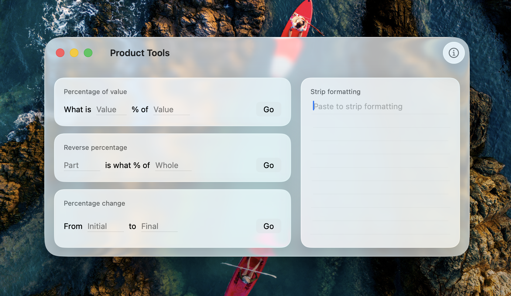

# Product Tools

A small macOS utility with percentage calculators and a paste-to-strip-formatting tool.

## Features

- **Percentage of value** — "What is X% of Y?"
- **Reverse percentage** — "X is what % of Y?"
- **Percentage change** — change % and multiplier between two values
- **Strip formatting** — paste rich text to get plain text back (strips emojis, extra whitespace, and tabs)

## Building

Open `ProductTools.xcodeproj` in Xcode and build. Requires macOS. Uses Liquid Glass on macOS Tahoe (26+), falls back to material blur on earlier versions.
